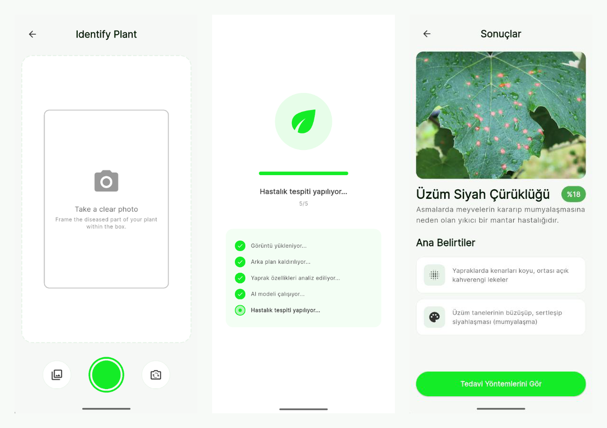
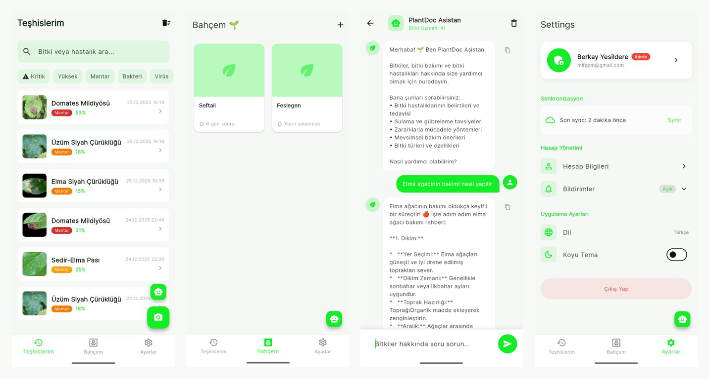
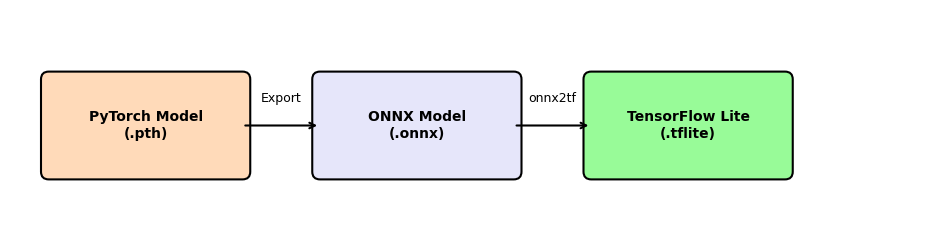
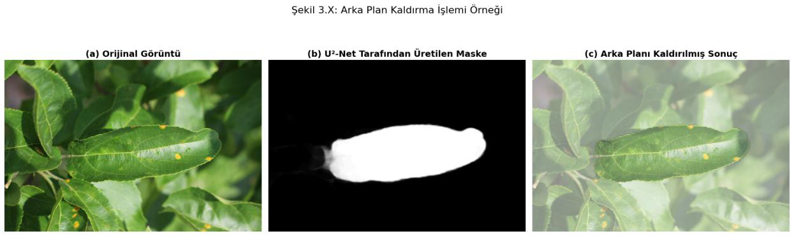
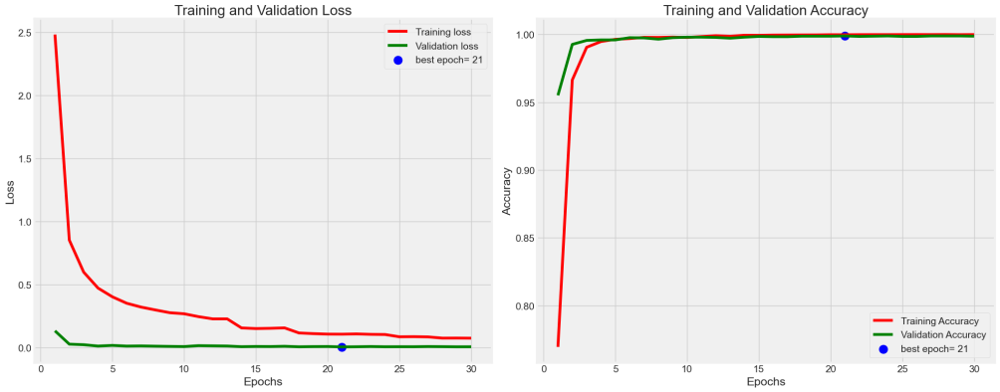

# Plant Disease Detector

Plant Disease Detector, yaprak fotoğraflarını cihaz üzerinde çalışan TensorFlow Lite modelleriyle analiz eden Flutter tabanlı bir akıllı tarım uygulamasıdır. Uygulama, bitki hastalığını tahmin eder, güven skorunu gösterir, hastalık belirtilerini ve tedavi önerilerini sunar; ayrıca sanal bahçe, bakım notları, sulama hatırlatmaları, bulut senkronizasyonu ve Gemini destekli bitki asistanı özelliklerini içerir.

Bu README, projedeki lisans tezi raporunun teknik özetinden hazırlanmıştır; literatür taraması bilinçli olarak dışarıda bırakılmıştır.

## Ekran Görüntüleri





## Temel Özellikler

- Kamera veya galeriden alınan yaprak fotoğrafı ile hastalık teşhisi
- U2-Net-P tabanlı arka plan temizleme ve görüntü ön işleme
- 38 sınıflı EfficientNet-B3 tabanlı TFLite sınıflandırma modeli
- Hastalık açıklaması, belirti listesi, patojen türü, risk seviyesi ve tedavi önerileri
- Teşhis geçmişi, arama ve filtreleme
- Sanal bahçe: bitki ekleme, bakım notları, sulama takibi ve bildirimler
- Hive ile çevrimdışı yerel veri saklama
- Supabase ile kimlik doğrulama, görsel depolama ve bulut senkronizasyonu
- Google Gemini API ile bitki bakımı ve hastalıkları konusunda uzmanlaşmış sohbet asistanı
- Açık/koyu tema ve Türkçe arayüz

## Sistem Akışı



Kullanıcı bir yaprak fotoğrafı seçtiğinde uygulama şu hattı izler:

1. Görüntü kamera veya galeriden alınır.
2. U2-Net-P modeli yaprak bölgesini arka plandan ayırır.
3. Görüntü 224x224 boyutuna getirilir ve model giriş formatına dönüştürülür.
4. `assets/plant_model.tflite` modeli sınıflandırma yapar.
5. En yüksek olasılıklı sınıf, güven skoru ve `assets/plants.json` içindeki tedavi bilgileri kullanıcıya gösterilir.
6. Teşhis, Hive üzerinde yerel olarak saklanır; kullanıcı giriş yapmışsa Supabase ile senkronize edilir.



## Model ve Performans

Rapor özetine göre sınıflandırma modeli PlantVillage veri seti üzerinde eğitilmiş EfficientNet-B3 tabanlı bir modeldir. Mobil kullanım için PyTorch modelinden ONNX ve TensorFlow Lite formatına dönüştürülmüştür.

| Metrik                                    | Değer             |
| ----------------------------------------- | ------------------ |
| Sınıf sayısı                          | 38                 |
| Eğitim doğruluğu                       | %100.00            |
| Doğrulama doğruluğu                    | %99.89             |
| Test doğruluğu                          | %99.85             |
| Raporlanan sınıflandırma modeli boyutu | yaklaşık 48 MB   |
| Repodaki sınıflandırma modeli asset'i  | yaklaşık 22.2 MB |
| Raporlanan U2-Net-P modeli boyutu         | yaklaşık 4.7 MB  |
| Repodaki U2-Net-P float16 asset'i         | yaklaşık 2.35 MB |
| Ortalama sınıflandırma süresi         | yaklaşık 200 ms  |
| Ortalama segmentasyon süresi             | yaklaşık 150 ms  |



## Teknoloji Yığını

- Flutter SDK ve Dart
- Riverpod ile durum yönetimi
- GoRouter ile yönlendirme
- TFLite Flutter ile cihaz üstü model çıkarımı
- `image` ve `flutter_image_compress` ile görüntü işleme
- Hive ile yerel depolama
- Supabase Auth, Database ve Storage
- Google Sign-In
- Google Generative AI
- Flutter Local Notifications

## Proje Yapısı

```text
lib/
  main.dart
  src/
    core/
      router/          # GoRouter yapılandırması
      services/        # Senkronizasyon, bildirim, AI, görsel servisleri
      storage/         # Hive yerel depolama
      supabase/        # Supabase ortam değişkenleri
      theme/           # Açık/koyu tema
    features/
      auth/            # Giriş, kayıt, misafir kullanıcı
      chat/            # PlantDoc Asistan
      diagnose/        # Fotoğraf alma, arka plan kaldırma, teşhis, tedavi
      garden/          # Sanal bahçe ve bakım takibi
      home/            # Teşhis geçmişi
      settings/        # Profil, tema ve senkronizasyon ayarları
assets/
  labels.txt
  plants.json
  plant_model.tflite
  models/u2netp_float16.tflite
docs/images/
  README görselleri
```

## Kurulum

1. Bağımlılıkları yükleyin:

```bash
flutter pub get
```

2. Ortam değişkenlerini hazırlayın:

```bash
cp .env.example .env
```

3. `.env` dosyasını kendi değerlerinizle doldurun:

```env
SUPABASE_URL=https://your-project-ref.supabase.co
SUPABASE_ANON_KEY=your-supabase-anon-key
GOOGLE_CLIENT_ID=your-google-oauth-client-id.apps.googleusercontent.com
GEMINI_API_KEY=your-gemini-api-key
```

4. Uygulamayı çalıştırın:

```bash
flutter run
```

## Supabase Notları

Uygulama Supabase tarafında şu kaynakları bekler:

- Storage bucket: `diagnosis-images`
- Tablolar: `profiles`, `diagnosis_history`, `plants`, `plant_notes`
- Google ile giriş kullanılacaksa Supabase Auth ve Google OAuth yapılandırması

Misafir kullanıcı modu yerel çalışır. Bulut senkronizasyonu, profil yönetimi ve yedekleme için Supabase ayarlarının tamamlanması gerekir.
